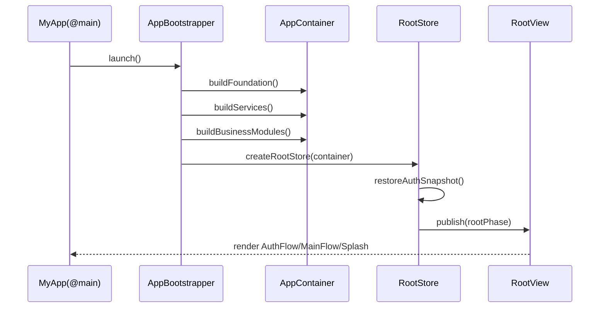

# M06 应用集成层设计（App Integration Layer）

> 适用范围：iOS MVP（SwiftUI App lifecycle），并为 Android / HarmonyOS 保留三端可复用的集成规范。  
> 约束基线：`principles.md`（四层与向下依赖）、`business-modules.md`（Auth/Session/Chat/Settings）、`services.md`（服务协议）、`foundation.md`（基础能力边界）。

---

## 1. 目标与边界

应用集成层负责：**组合根（Composition Root）+ 启动编排（Bootstrap）+ 依赖注入（DI）+ 根路由装配（Root Assembly）**。

- ✅ 做什么：
  - 从 `@main App` 到首屏展示的完整启动链路
  - 服务与模块的实例注册、生命周期管理
  - Root 页面根据鉴权状态切换 Auth Flow / Main Flow
  - 导航入口与 Deep Link 分发
- ❌ 不做什么：
  - 不承载业务规则（例如消息排序、分页逻辑）
  - 不定义服务层/基础层内部实现细节
  - 不在此层编写具体业务页面 SARE 逻辑

---

## 2. 启动流程设计（App Entry → First Screen）

## 2.1 启动链路（时序）



## 2.2 分阶段说明

1. **App 入口阶段**（`MyApp.init` / `App.body`）
   - 创建 `AppBootstrapper`。
   - 执行最小同步初始化：Logger、崩溃保护、环境参数加载。

2. **容器构建阶段**（Composition Root）
   - 先构建 Foundation 实现（NetworkCore/StorageCore/SecureStoreCore...）。
   - 基于 Foundation 构建服务层实现（AuthService、ChatService 等）。
   - 再构建业务模块工厂（AuthModuleFactory、SessionModuleFactory...）。

3. **Root 判定阶段**
   - RootStore 启动后读取 Auth 快照（本地 token + AuthService 状态流）。
   - 在有限时间内（如 300~800ms）完成首次鉴权判定；超时进入可恢复中间态（Splash）。

4. **首屏展示阶段**
   - `signedOut/expired` -> Auth Flow（Login/Register）。
   - `signedIn` -> Main Flow（SessionList 默认首屏）。
   - 判定中 -> Splash/Loading（短暂）。

---

## 3. 依赖注入方案（轻量 DI）

## 3.1 方案选择

采用 **手动 DI + Protocol + Factory**，不引入 Swinject 等重框架。

- 手动 DI 可控、可读、调试成本低
- Protocol 保障可测试性（可替换 mock/fake）
- Factory 负责模块装配，避免 View 直接 `new` 依赖

## 3.2 容器结构（建议）

```text
AppContainer
├─ foundation
│  ├─ networkCore
│  ├─ storageCore
│  ├─ secureStoreCore
│  ├─ logCore
│  ├─ concurrencyCore
│  └─ platformCore
├─ services
│  ├─ authService
│  ├─ apiClientService
│  ├─ chatService
│  ├─ sessionService
│  ├─ storageService
│  ├─ connectivityService
│  └─ toolExecutionService
└─ modules
   ├─ authModuleFactory
   ├─ sessionModuleFactory
   ├─ chatModuleFactory
   └─ settingsModuleFactory
```

## 3.3 生命周期策略

- **AppScope 单例**：基础层核心对象、服务层对象（连接池、数据库、认证状态）。
- **FlowScope**：导航流持有的 store/router（AuthFlow、MainFlow）。
- **PageScope**：页面级 store（进入页面创建，离开释放）。

## 3.4 注入方式

- 组合根中构造 `AppContainer` 后，通过：
  - `Environment` 注入跨树共享对象（如 `AppRouter`, `RootStore`）。
  - Factory 显式构造页面 store（如 ChatStore(sessionId:)）。
- 禁止页面内直接创建服务实现类型。

---

## 4. 导航/路由架构

## 4.1 总体结构（MVP）

```text
App Entry
  └─ Root
      ├─ Auth Flow
      │   ├─ Login
      │   └─ Register
      └─ Main Flow
          ├─ Session List
          │   └─ Chat Room(sessionId)
          └─ Settings
```

## 4.2 路由模型（可三端对齐）

建议抽象统一路由语义：

```text
AppRoute
- auth(AuthRoute)
- main(MainRoute)

AuthRoute
- login
- register

MainRoute
- sessions
- chat(sessionId)
- settings
```

说明：
- iOS 用 `NavigationStack + NavigationPath` 承载。
- Android/HarmonyOS 可映射到各自导航组件，但 **Route 语义保持一致**。

## 4.3 跳转规则

- Auth 内：`login <-> register`。
- Main 内：`sessions -> chat(sessionId)`，`sessions -> settings`。
- 跨 Flow 跳转仅由 RootStore 驱动（例如 logout 触发 Main -> Auth），页面不可直接越级跳转。

## 4.4 Deep Link 预留

统一定义 `DeepLinkTarget`：
- `myapp://login`
- `myapp://session/{sessionId}`
- `myapp://settings`

分发原则：
1. AppIntegration 先解析 URL -> `DeepLinkTarget`
2. 若需鉴权且未登录：暂存目标，先进入 Auth Flow
3. 登录成功后消费 pending deep link 并跳转

`Universal Link` 与各端 scheme 注册方式平台特定，语义保持一致。

---

## 5. Root 页面逻辑（auth 决策）

## 5.1 Root 状态

```text
RootPhase
- launching
- unauthenticated
- authenticated(userId)
- authExpired
```

## 5.2 决策来源

- `AuthService.observeAuthState()`（主信号）
- `AuthService.currentAccessToken()`（冷启动快照）
- 可选：`ConnectivityService`（离线时 UI 提示，不改变 auth 语义）

## 5.3 决策规则

- `signedIn` -> `authenticated`
- `signedOut` -> `unauthenticated`
- `expired` -> `authExpired`（展示登录并可提示会话过期）
- `refreshing` -> `launching`（短暂中间态）

## 5.4 状态切换触发

- 登录成功：Auth Flow 结束，重置 MainFlow 导航栈到 `sessions`
- 登出成功：清空 MainFlow 导航栈，切回 `login`
- token 刷新失败：统一走 `authExpired -> login`

---

## 6. 与 SwiftUI App Lifecycle 对接

## 6.1 对接点

- `@main struct MyApp: App`：应用入口与容器持有者。
- `@State` / `@StateObject`（或 iOS17 `@Observable`）持有 `RootStore`、`AppRouter`。
- `@Environment(\.scenePhase)` 监听前后台切换并转发给 `ConnectivityService/ChatService`。

## 6.2 建议骨架（示意）

```swift
@main
struct MyApp: App {
    @Environment(\.scenePhase) private var scenePhase
    @State private var bootstrap = AppBootstrapper()
    @State private var rootStore: RootStore

    init() {
        let container = AppBootstrapper().buildContainer()
        _rootStore = State(initialValue: RootStore(container: container))
    }

    var body: some Scene {
        WindowGroup {
            RootView(store: rootStore)
        }
        .onChange(of: scenePhase) { _, phase in
            rootStore.handleScenePhase(phase)
        }
    }
}
```

> 注：最终采用 `@Observable` 还是 `ObservableObject`，取决于团队对 iOS 17+ 全量目标的工程策略。**[待确认]**

---

## 7. 三端一致性说明

## 7.1 可三端复用（规范级）

- Composition Root 思想（先基础、后服务、再业务装配）
- DI 策略（手动 DI + protocol + factory）
- RootPhase/AuthPhase 语义
- 路由模型（`AppRoute/AuthRoute/MainRoute`）
- Deep Link 语义与“先鉴权后分发”规则

## 7.2 平台特定实现

- iOS：SwiftUI lifecycle + NavigationStack
- Android：Application/Activity + Navigation Component（或同类）
- HarmonyOS：Stage model + 对应路由机制

## 7.3 一致性验收用例（建议）

1. 冷启动：已登录用户直接进入 SessionList。
2. 冷启动：token 失效进入登录页并提示。
3. Deep link 到 chat：未登录先登录，后跳指定会话。
4. 登出：任意页面触发后回到 login，且主导航栈清空。

---

## 8. 实施清单（M06 落地）

1. 定义 `AppContainer` 与各层装配顺序
2. 实现 `AppBootstrapper`（构建 + 预热）
3. 实现 `RootStore`（Auth 状态监听 + RootPhase 决策）
4. 实现 `AppRouter` 与 Route 枚举
5. 接入 `RootView`（AuthFlow/MainFlow 切换）
6. 增加 DeepLinkParser 与 pending deep link 缓存
7. 接入 `scenePhase` 事件转发

---

## 9. 待确认项

1. Root 启动阶段可接受的最长等待时长（Splash 超时阈值）**[待确认]**
2. Main Flow 使用 Tab 还是侧边/菜单入口承载 Settings **[待确认]**
3. iOS 17+ 是否全面采用 `@Observable`（兼容策略）**[待确认]**
4. Deep link 安全策略（是否限制来源、是否要求二次校验）**[待确认]**
5. 登录后 pending deep link 的失效时间与队列策略 **[待确认]**

---

完成时间：2026-02-20 12:16 (GMT+8)
