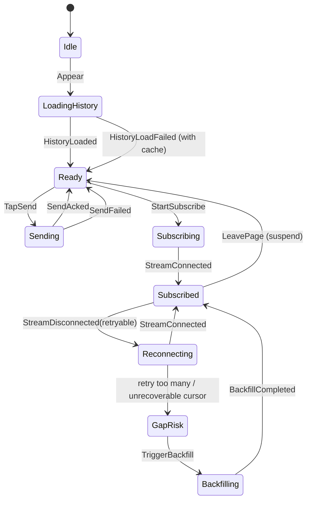

# M05 业务模块划分（Business Layer）

> 适用范围：iOS MVP（优先），并为 Android / HarmonyOS 保留三端接口与行为一致性。
>  
> 约束基线：`principles.md`（四层、向下依赖、SARE）、`services.md`（服务层接口）、`foundation.md`（基础能力边界）。

---

## 1. 设计目标与边界

业务层按业务垂直拆分模块，承载页面状态、交互规则与流程编排；不直接触达底层 SDK。

- ✅ 做什么：
  - 定义模块内 SARE（State / Action / Reducer / Effect）
  - 编排 Auth / Session / Chat / Settings 的页面流程
  - 通过服务层接口完成网络、缓存、连接状态等协作
- ❌ 不做什么：
  - 不直接调用 gRPC / GRDB / Keychain / 系统可达性 API
  - 不在业务层定义应用启动与 DI 组装（属于 M06）
  - 不在业务层承载纯技术基础能力（属于 M03）

---

## 2. MVP 业务模块清单（职责 + 边界 + 页面）

## 2.1 Auth 模块

**职责**
- 登录/注册流程编排
- 鉴权状态驱动页面切换（signedOut / signedIn / expired）
- 处理 token 失效后的用户可见流程（跳转登录、提示）

**边界**
- 不处理会话列表聚合与聊天消息流
- 不直接管理 token 存储细节（委托 `AuthService`）

**拥有页面**
- 登录页（Login）
- 注册页（Register）

---

## 2.2 Session 模块

**职责**
- 会话列表加载、分页、下拉刷新
- 会话项展示状态（最近消息、更新时间、未读标记）
- 跳转 Chat 页面并传递 `sessionId`

**边界**
- 不处理聊天流式增量渲染
- 不处理鉴权流程（依赖 Auth 模块提供已登录态）

**拥有页面**
- 会话列表页（SessionList）

---

## 2.3 Chat 模块（核心）

**职责**
- 聊天页面完整交互：输入、发送、流式回复、工具调用反馈、错误恢复
- 管理会话级订阅生命周期（进入、离开、重连、恢复）
- 管理消息时间线投影（本地草稿/待发送/服务端增量）

**边界**
- 不直接做工具执行底层实现（委托 `ToolExecutionService`）
- 不管理会话列表分页（委托 Session 模块）

**拥有页面**
- 聊天页（ChatRoom）

---

## 2.4 Settings 模块（MVP 可选）

**职责**
- 展示基础个人信息（如 display name）
- 提供退出登录入口

**边界**
- 不承载复杂账户安全策略
- 不承载业务核心流程

**拥有页面**
- 设置页（Settings）
- 个人信息子页（Profile，可选）

---

## 3. 每个模块的 SARE 落地

> 统一格式：State（最小必要字段）/ Action（用户与系统事件）/ Reducer（纯状态迁移）/ Effect（副作用）。

## 3.1 Auth 模块 SARE

### State
- `authPhase`: `idle | signingIn | signingUp | signedIn | signedOut | expired`
- `email`, `password`, `displayName`
- `errorMessage: String?`
- `isSubmitEnabled: Bool`

### Action
- User: `InputEmail`, `InputPassword`, `InputDisplayName`, `TapLogin`, `TapRegister`, `TapLogout`
- System: `LoginSucceeded`, `RegisterSucceeded`, `AuthExpired`, `LogoutSucceeded`, `RequestFailed`

### Reducer
- 输入类 Action 更新字段并重算 `isSubmitEnabled`
- `TapLogin/TapRegister` -> `authPhase=signingIn/signingUp` + 清空错误
- `LoginSucceeded/RegisterSucceeded` -> `signedIn`
- `AuthExpired` -> `expired`
- `RequestFailed` -> 保持在可重试状态并设置 `errorMessage`

### Effect
- 调 `AuthService.login/register/logout`
- 订阅 `AuthService.observeAuthState()` 并转 Action

---

## 3.2 Session 模块 SARE

### State
- `items: [SessionListItem]`
- `loadingPhase: idle | initialLoading | refreshing | paginating | failed`
- `nextPageToken: String?`
- `selectedSessionId: String?`
- `errorMessage: String?`

### Action
- User: `Appear`, `PullToRefresh`, `ScrollToBottom`, `TapSession(sessionId)`
- System: `LoadSucceeded(items,nextToken)`, `LoadFailed(error)`, `SessionUpdated(event)`

### Reducer
- `Appear` 首次触发初始加载
- `PullToRefresh` 重置分页状态
- `ScrollToBottom` 且有 `nextPageToken` 时进入 `paginating`
- `LoadSucceeded` 合并/覆盖列表并更新 token
- `TapSession` 仅更新 `selectedSessionId`（导航由上层协调）

### Effect
- 调 `SessionService.listSessions/getSession`
- 读取 `StorageService.listCachedSessions` 做首屏缓存回填

---

## 3.3 Chat 模块 SARE（详细）

## 3.3.1 State 设计

```text
ChatState
- sessionId: String
- title: String?
- timeline: [ChatTimelineItem]
  - userMessage / assistantMessage / toolCall / systemNotice / errorNotice
- composer:
  - draftText: String
  - attachments: [AttachmentRef] (MVP 可为空)
  - canSend: Bool
- sending:
  - pendingQueue: [PendingMessage]
  - isSendingNow: Bool
- stream:
  - status: idle | subscribing | subscribed | reconnecting | suspended | failed
  - lastEventId: String?
  - reconnectAttempt: Int
- round:
  - isAgentResponding: Bool
  - currentRoundId: String?
- ui:
  - toast: Toast?
  - inlineError: String?
  - isHistoryLoading: Bool
- consistency:
  - hasGapRisk: Bool
  - needsBackfill: Bool
```

**状态语义要点（三端必须一致）**
- `timeline` 是唯一渲染源，UI 不拼接临时变量。
- `lastEventId` 仅在事件落库成功后推进。
- `pendingQueue` 反映“待发送事实”，不是 UI loading 替代品。
- `hasGapRisk/needsBackfill` 显式表达断点恢复风险，避免隐式逻辑。

---

## 3.3.2 Action 设计

### 用户动作（User Intent）
- `Appear(sessionId)`
- `InputChanged(text)`
- `TapSend`
- `TapRetrySend(localId)`
- `TapRetrySubscribe`
- `TapCancelRound`
- `LeavePage`

### 系统事件（System Event）
- `HistoryLoaded(messages)` / `HistoryLoadFailed`
- `SendAcked(localId, remoteMessageId)` / `SendFailed(localId,error)`
- `StreamConnected`
- `StreamEventReceived(event)`
  - `TextChunk`
  - `ToolRequest`
  - `RoundComplete`
  - `ChatError`
- `StreamDisconnected(retryable)`
- `ReconnectTick(attempt)`
- `ConnectivityChanged(state)`
- `ToolExecuted(toolCallId,result)` / `ToolExecutionFailed(toolCallId,error)`
- `BackfillCompleted` / `BackfillFailed`

---

## 3.3.3 Reducer 规则（纯函数）

### A. 发送主链路
1. `TapSend` 且 `canSend=true`：
   - 生成 `localId/requestId`
   - 追加一条本地 user message（`status=queued`）到 `timeline`
   - 入 `pendingQueue`
   - 清空 `draftText`
2. `SendAcked`：
   - 对应消息 `queued -> sent`
   - 若当前未订阅，标记需要启动订阅
3. `SendFailed`：
   - 消息状态改为 `failed`
   - 写入可见错误（可重试）

### B. 订阅与流式回复
1. `StreamConnected`：`stream.status=subscribed`
2. `TextChunk`：
   - 按 `messageId` 聚合 assistant 文本增量
   - `round.isAgentResponding=true`
3. `ToolRequest`：
   - 插入 `toolCall` 时间线项（状态 `running`）
4. `ToolExecuted/ToolExecutionFailed`：
   - 更新对应 `toolCall` 项状态为 `done/failed`
5. `RoundComplete`：
   - `isAgentResponding=false`
   - 完结本轮状态

### C. 断线恢复
1. `StreamDisconnected(retryable=true)`：`status=reconnecting` + `reconnectAttempt+1`
2. `ReconnectTick`：只更新尝试次数，不做 IO
3. 多次失败后置 `hasGapRisk=true`
4. 若服务端提示断点不可恢复：`needsBackfill=true`
5. `BackfillCompleted`：清除 gap 风险，重建时间线一致性

### D. 生命周期
- `Appear`：标记加载历史 + 启动订阅准备
- `LeavePage`：`status=suspended`，停止页面级瞬时 UI（不改持久数据）

---

## 3.3.4 Effect 编排（副作用）

1. **初始化**
   - `StorageService.listCachedMessages(sessionId)` 先回填
   - 并发触发 `SessionService.listSessionMessages` 做增量修正
2. **发送消息**
   - 调 `ChatService.sendMessage(requestId, sessionId, ...)`
   - 失败则保留 pending 并等待重试触发
3. **建立订阅**
   - 调 `ChatService.subscribe(sessionId,lastEventId)`
   - 每个 event：先写入 `StorageService`，成功后再派发 `StreamEventReceived`
4. **工具调用闭环**
   - `ToolRequest` -> `ToolExecutionService.handleToolRequest`
   - 完成后 `ChatService.submitToolResult`
5. **网络恢复**
   - 监听 `ConnectivityService.observeState`
   - 从 offline -> online 时触发重连与 pending 重发

---

## 3.3.5 Chat 模块状态机（简化）



---

## 3.4 Settings 模块 SARE

### State
- `profile: UserProfile?`
- `isLoading: Bool`
- `logoutPhase: idle | submitting | done | failed`
- `errorMessage: String?`

### Action
- `Appear`
- `TapLogout`
- `ProfileLoaded`
- `LogoutSucceeded`
- `RequestFailed`

### Reducer
- `Appear` -> `isLoading=true`
- `TapLogout` -> `logoutPhase=submitting`
- `LogoutSucceeded` -> `logoutPhase=done`
- `RequestFailed` -> `failed + errorMessage`

### Effect
- 读取用户展示信息（来源可为 Auth/Session 聚合，MVP 从本地缓存优先）
- 调 `AuthService.logout`

---

## 4. 模块间依赖关系图

```mermaid
graph TD
    A[App Integration Layer(M06)] --> B1[Auth Module]
    A --> B2[Session Module]
    A --> B3[Chat Module]
    A --> B4[Settings Module]

    B2 --> B3:::soft
    B4 --> B1:::soft

    B1 --> S1[AuthService]
    B2 --> S2[SessionService]
    B2 --> S4[StorageService]
    B3 --> S3[ChatService]
    B3 --> S2
    B3 --> S4
    B3 --> S5[ConnectivityService]
    B3 --> S6[ToolExecutionService]
    B4 --> S1

    classDef soft stroke-dasharray: 5 5;
```

说明：
- 业务模块默认不直接硬依赖同层模块；`Session -> Chat` 是导航上下文传递，不是实现耦合。
- `Settings -> Auth` 仅通过鉴权语义协作（退出登录后状态切换）。

---

## 5. 各模块依赖的服务层接口清单

| 业务模块 | 必需服务接口 | 用途 |
|---|---|---|
| Auth | `AuthService`, `ConnectivityService` | 登录注册、鉴权状态监听、离线提示 |
| Session | `SessionService`, `StorageService`, `ConnectivityService` | 会话列表分页、缓存首屏、网络状态联动 |
| Chat | `ChatService`, `SessionService`, `StorageService`, `ConnectivityService`, `ToolExecutionService` | 消息收发、历史修正、流式订阅、离线恢复、工具闭环 |
| Settings | `AuthService`（可选 `StorageService`） | 退出登录、个人信息读取 |

---

## 6. 模块间通信方式

## 6.1 事件（Event）
- `AuthStateChanged`：Auth -> 全局路由/其他模块
- `SessionUpdated`：Chat 产生新消息后通知 Session 刷新列表投影
- `ConnectivityChanged`：Connectivity 广播给 Auth/Session/Chat

## 6.2 接口调用（Service Interface）
- 模块不互调实现，统一经服务层接口协作。
- 如 Chat 不直接写 Session 列表，而是写消息后由 Session 读取统一数据源刷新。

## 6.3 共享模型（Shared Model）
- 共享 DTO 放在服务层/基础层语义模型中（如 `SessionDTO`, `MessageDTO`）。
- 业务层可定义本模块 ViewModel 映射，避免跨模块共享 UI Model。

---

## 7. 三端一致性说明

## 7.1 必须三端对齐（语义一致）
- 模块边界与依赖方向（Auth/Session/Chat/Settings）
- SARE 的状态语义与 Action 语义
- Chat 核心状态机（发送、订阅、重连、补齐）
- 错误语义（可重试 / 不可重试 / 需回登录）

## 7.2 平台特定（实现可不同）
- UI 组件与交互细节（输入框行为、动效、系统手势）
- 生命周期钩子接入（前后台事件 API）
- 本地通知、键盘、可访问性适配

## 7.3 一致性验收建议
- 以行为用例验收，而非代码逐行一致：
  1. 离线发送 -> 恢复网络 -> 自动重发
  2. 流式回复中断 -> 重连后续传
  3. token 过期 -> 刷新失败 -> 回到登录态

---

## 8. 当前待确认项

1. Settings 是否在 MVP 首版上线，或仅保留最小“退出登录”入口 **[待确认]**
2. Chat 的 `TapCancelRound` 是否映射服务端中断接口（当前服务接口未明确）**[待确认]**
3. 断点不可恢复时，Backfill 的拉取窗口与性能上限 **[待确认]**
4. Session 未读计数在 MVP 是否启用真实服务端字段还是本地推导 **[待确认]**
5. 附件能力在 ChatState 中暂留占位，MVP 是否启用 **[待确认]**

---

完成时间：2026-02-20 11:18 (GMT+8)
