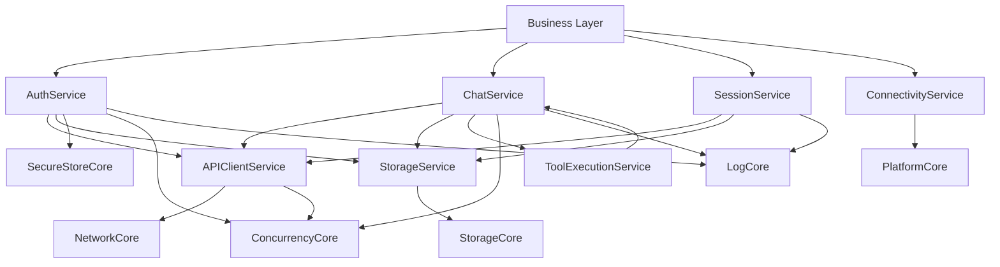

# M04 服务层设计（Service Layer）

> 适用范围：iOS MVP（优先），并为 Android / HarmonyOS 保留三端接口对齐空间。  
> 约束基线：`principles.md`（四层 + 向下依赖 + 网络不可靠前提）、`tech-stack.md`（Swift Concurrency / grpc-swift / GRDB）、`foundation.md`（基础能力边界）。

---

## 1. 设计目标与边界

服务层位于 **业务层 与 基础层之间**，负责把基础能力编排为业务可消费的稳定接口。

- ✅ 做什么：
  - 定义全局可复用服务协议（Protocol）
  - 封装 gRPC / 本地存储 / 鉴权 / 连接状态细节
  - 提供统一错误语义与恢复策略
  - 管理流式连接生命周期（订阅、重连、前后台切换）
- ❌ 不做什么：
  - 不承载页面状态与交互规则（属于业务层，M05）
  - 不暴露三方库实现细节（grpc-swift / GRDB / Keychain）
  - 不承担应用启动编排与 DI 根装配（属于应用集成层，M06）

---

## 2. 服务模块划分（MVP）

## 2.1 `AuthService`

**职责**
- 用户注册/登录/登出
- Access/Refresh Token 生命周期管理
- Token 刷新与失效处理
- 向 NetworkService 提供认证凭据读取能力

**边界**
- 不直接处理聊天消息业务
- 不暴露 SecureStore 细节，仅暴露 token 语义接口

---

## 2.2 `APIClientService`（或 `NetworkService`）

**职责**
- 封装对服务端 gRPC 的调用入口
- 管理连接状态、超时、重试、基础重连
- 统一注入认证头（与 AuthService 协作）
- 暴露流式调用基类能力（供 ChatService 使用）

**边界**
- 不定义聊天事件语义本身（由 ChatService 解释）
- 不定义具体业务对象聚合规则

---

## 2.3 `ChatService`

**职责**
- 对齐服务端 `ChatService`：`SendMessage / Subscribe / SubmitToolResult`
- 管理会话级订阅流（断线重连、event 去重）
- 把服务端 `ChatEvent` 映射为客户端统一事件模型
- 协同 StorageService 做消息本地缓存写入

**边界**
- 不直接做页面状态管理
- 不执行业务层“会话列表排序规则”等 UI 逻辑

---

## 2.4 `SessionService`

**职责**
- 对齐服务端 `SessionService`（会话列表、详情、历史消息分页）
- 提供会话数据读写编排：远端拉取 + 本地缓存更新
- 为业务层提供统一会话查询入口

**边界**
- 不负责聊天实时流（由 ChatService 负责）

---

## 2.5 `StorageService`

**职责**
- 封装本地业务数据仓储（会话、消息、游标、待发送队列）
- 提供事务化写入能力（如消息入库 + 游标更新原子提交）
- 为离线读取提供标准查询接口

**边界**
- 不暴露 GRDB/SQL 细节
- 不直接访问网络

---

## 2.6 `ConnectivityService`

**职责**
- 监听网络可达性与应用生命周期变化
- 向上游发布连接状态事件（online/offline/foreground/background）
- 触发服务层恢复动作（如重连订阅、重试待发送）

**边界**
- 不直接发起业务请求，只提供状态与触发信号

---

## 2.7 `ToolExecutionService`（MVP 最小实现）

**职责**
- 接收 ChatService 分发的 `ToolRequest`
- 路由到客户端可用工具执行器
- 通过 ChatService 回传 `SubmitToolResult`

**状态**
- 工具注册机制、沙箱权限策略：**[待确认]**

---

## 3. 对外接口草案（Protocol 级 + 关键签名）

> 说明：以下为服务层接口草案，语义需三端对齐；Swift 仅作 MVP 参考形态。

```swift
// MARK: - Shared Models

public struct TokenPairDTO {
    let accessToken: String
    let refreshToken: String
    let accessTokenExpiresAt: Date
    let refreshTokenExpiresAt: Date
}

public enum ServiceError: Error {
    case unauthenticated
    case permissionDenied
    case invalidArgument(message: String)
    case notFound
    case conflict
    case rateLimited(retryAfter: TimeInterval?)
    case timeout
    case unavailable
    case cancelled
    case networkUnreachable
    case streamClosed(retryable: Bool)
    case storageFailure(message: String)
    case serializationFailure(message: String)
    case unknown(code: String, message: String)
}

public enum ConnectionState {
    case online
    case offline
    case reconnecting(attempt: Int)
    case backgroundSuspended
}

// MARK: - AuthService

public protocol AuthService {
    func register(inviteCode: String, email: String, password: String, displayName: String?) async throws -> TokenPairDTO
    func login(email: String, password: String, deviceName: String, platform: String) async throws -> TokenPairDTO
    func refreshTokenIfNeeded(force: Bool) async throws -> TokenPairDTO
    func logout(logoutAllDevices: Bool) async throws

    func currentAccessToken() async -> String?
    func observeAuthState() -> AsyncStream<AuthState>
}

public enum AuthState {
    case signedOut
    case signedIn(userId: String)
    case refreshing
    case expired
}

// MARK: - APIClientService

public protocol APIClientService {
    func unary<Req, Resp>(_ method: GRPCMethod<Req, Resp>, request: Req, timeout: TimeInterval?) async throws -> Resp
    func serverStream<Req, Event>(_ method: GRPCStreamMethod<Req, Event>, request: Req) throws -> AsyncThrowingStream<Event, Error>
    func closeAllConnections() async
}

// MARK: - ChatService

public protocol ChatService {
    func sendMessage(requestId: String, sessionId: String?, agentId: String, content: [ContentBlockDTO], metadata: [String: String]) async throws -> SendMessageAckDTO
    func subscribe(sessionId: String, lastEventId: String?) -> AsyncThrowingStream<ChatEventDTO, Error>
    func submitToolResult(sessionId: String, toolCallId: String, resultJSON: String, isError: Bool, errorMessage: String?) async throws -> Bool
}

// MARK: - SessionService

public protocol SessionService {
    func listSessions(pageSize: Int, pageToken: String?) async throws -> SessionPageDTO
    func getSession(sessionId: String) async throws -> SessionDTO
    func listSessionMessages(sessionId: String, pageSize: Int, pageToken: String?) async throws -> MessagePageDTO
}

// MARK: - StorageService

public protocol StorageService {
    func upsertSessions(_ sessions: [SessionDTO]) async throws
    func upsertMessages(_ messages: [MessageDTO], sessionId: String) async throws
    func listCachedSessions(limit: Int, cursor: String?) async throws -> [SessionDTO]
    func listCachedMessages(sessionId: String, limit: Int, cursor: String?) async throws -> [MessageDTO]

    func saveLastEventId(_ eventId: String, sessionId: String) async throws
    func loadLastEventId(sessionId: String) async throws -> String?

    func enqueuePendingMessage(_ pending: PendingMessageDTO) async throws
    func listPendingMessages(sessionId: String?) async throws -> [PendingMessageDTO]
    func markPendingMessageSent(localId: String, remoteMessageId: String) async throws
}

// MARK: - ConnectivityService

public protocol ConnectivityService {
    func currentState() async -> ConnectionState
    func observeState() -> AsyncStream<ConnectionState>
}

// MARK: - ToolExecutionService

public protocol ToolExecutionService {
    func handleToolRequest(_ request: ToolRequestDTO, sessionId: String) async -> ToolExecutionResultDTO
}
```

---

## 4. 服务间依赖关系与协作



**关键协作链路（MVP 聊天）**
1. 业务层调用 `ChatService.sendMessage`
2. ChatService 经 `APIClientService` 调 `ChatService.SendMessage`
3. 返回 ACK 后写入 `StorageService`（本地消息状态）
4. ChatService 建立/恢复 `subscribe(sessionId,lastEventId)`
5. 收到 `TextChunk/ToolRequest/RoundComplete/Error`：
   - TextChunk：增量落库并向上派发
   - ToolRequest：交给 ToolExecutionService 执行并回传 SubmitToolResult
   - RoundComplete：标记本轮完成
   - Error：按 retryable 决定重试或终止

---

## 5. 与基础层（M03）协作映射

| 服务层模块 | 使用的基础层模块 | 使用方式 |
|---|---|---|
| AuthService | SecureStoreCore / NetworkCore / ConcurrencyCore / LogCore | 安全存 token；登录/刷新请求；刷新重试；鉴权日志 |
| APIClientService | NetworkCore / ConcurrencyCore / LogCore | unary/stream 封装；超时与重连；请求追踪日志 |
| ChatService | APIClientService / StorageService / ConcurrencyCore / LogCore | 消息收发；流事件处理；去重与恢复 |
| SessionService | APIClientService / StorageService / LogCore | 会话与历史分页；缓存同步 |
| StorageService | StorageCore / LogCore | 仓储化 CRUD、事务、迁移后兼容 |
| ConnectivityService | PlatformCore / LogCore | 网络可达性与生命周期监听 |
| ToolExecutionService | ConcurrencyCore / LogCore | 工具执行超时、取消、结果标准化 |

---

## 6. 与服务端 gRPC 对齐说明

## 6.1 Auth 对齐

服务端：`AuthService.Register/Login/RefreshToken/Logout`  
客户端：`AuthService` 四个主方法一一映射，额外提供：
- `refreshTokenIfNeeded(force:)`：客户端策略方法（非直接 rpc）
- `currentAccessToken()`：供拦截器注入 Authorization 头

## 6.2 Chat 对齐

服务端：`SendMessage`、`Subscribe(stream ChatEvent)`、`SubmitToolResult`。  
客户端 `ChatService` 保持同名语义，并补充：
- 订阅恢复参数 `lastEventId`（来自本地持久化）
- 事件模型对齐：`TextChunk / ToolRequest / RoundComplete / ChatError`

## 6.3 Session 对齐（MVP 必需）

虽然 brief 核心流程聚焦聊天，但 MVP 存在“会话列表/历史消息”流程，因此客户端 `SessionService` 对齐服务端：
- `ListSessions`
- `GetSession`
- `ListSessionMessages`

`Create/Update/DeleteSession` 在客户端是否立即开放：**[待确认]**（取决于 MVP 产品是否提供会话管理 UI）。

## 6.4 Channel 系统语义对齐

依据服务端 channel 设计，客户端遵循：
- 主时间线语义由服务端会话事件驱动
- 客户端只做本地投影缓存，不重定义事件顺序权威
- 渠道能力降级主要发生在服务端 ChannelAdapter，客户端 Native 通道保持高保真事件语义

---

## 7. 连接生命周期与重连策略（流式 Subscribe）

## 7.1 状态机（概念）

`Idle -> Connecting -> Subscribed -> Reconnecting -> Subscribed -> Closed`

触发条件：
- 网络断开：`Subscribed -> Reconnecting`
- App 进入后台：`Subscribed -> backgroundSuspended`
- App 回前台且网络可用：重新 `Subscribe(lastEventId)`

## 7.2 重连策略

- 指数退避：1s / 2s / 4s / 8s / 16s（上限 30s）
- 抖动：±20%
- 上限次数：持续重试直到网络恢复或用户退出会话
- 每次重连必须携带最近持久化 `last_event_id`

## 7.3 去重与续传

- 事件去重键：`(session_id, event_id)`
- 先落库再派发，防止 UI 收到后崩溃导致游标丢失
- 若服务端返回断点不可恢复（历史窗口已过期）：触发一次会话消息全量补齐流程 **[待确认]**

---

## 8. 消息缓存与同步策略（MVP）

## 8.1 本地写入策略

- `SendMessage` 成功 ACK 后写入本地 user message（状态 `sent`）
- `TextChunk` 到达即增量写入 assistant message（按 `message_id` 聚合）
- `RoundComplete` 标记本轮完成并刷新会话 `updated_at`

## 8.2 拉取与修正策略

- 进入会话优先读取本地缓存（快速首屏）
- 后台触发 `ListSessionMessages` 增量拉取做一致性修正
- 冲突时以服务端版本为准（服务端主时间线）

## 8.3 离线发送（MVP 约束）

- 离线时写入 `pending_messages`
- 网络恢复后按入队顺序重发，使用 `request_id` 保证幂等
- 跨设备消息乱序的最终一致策略：**[待确认]**

---

## 9. 错误处理策略（服务层统一包装）

## 9.1 错误分层

1. **基础层错误**（NetworkCore/StorageCore/SecureStoreCore）  
2. **服务端 gRPC 错误**（Status + ErrorCode）  
3. **服务层语义错误**（如 streamClosed、tokenExpired）

服务层统一输出 `ServiceError`，不向业务层透传底层错误类型。

## 9.2 gRPC 到 ServiceError 映射

| gRPC Status / ErrorCode | ServiceError | 默认处理策略 |
|---|---|---|
| UNAUTHENTICATED | .unauthenticated | 触发 Auth 刷新；失败则登出 |
| PERMISSION_DENIED | .permissionDenied | 终止请求并提示无权限 |
| INVALID_ARGUMENT | .invalidArgument | 不重试，提示参数问题 |
| NOT_FOUND | .notFound | 不重试，业务层做空态 |
| RESOURCE_EXHAUSTED + RATE_LIMITED | .rateLimited | 延迟重试（若有 retry-after） |
| DEADLINE_EXCEEDED | .timeout | 可重试（幂等前提） |
| UNAVAILABLE | .unavailable | 进入重连/重试流程 |
| CANCELLED | .cancelled | 视为用户/系统取消 |
| 本地网络不可达 | .networkUnreachable | 挂起请求、等待恢复 |
| 序列化/解码失败 | .serializationFailure | 记录错误并上报 |
| SQLite/Keychain 失败 | .storageFailure | 回退降级路径 + 告警 |

## 9.3 Token 刷新协作

- 当 APIClient 收到 `UNAUTHENTICATED`：
  1. 触发 AuthService 单飞刷新（single-flight）
  2. 刷新成功：重放一次原请求
  3. 刷新失败：广播 `AuthState.expired`
- 刷新并发控制实现细节：**[待确认]**（actor 锁 or request coalescing 实现方案）

---

## 10. 可测试性与验收点

- 每个服务协议必须可 mock（业务层单测不依赖真实网络/数据库）
- ChatService 需具备可注入事件流测试能力（断线、重连、乱序、重复事件）
- AuthService 需覆盖 token 过期、刷新失败、并发刷新场景
- StorageService 需覆盖事务一致性与迁移兼容

---

## 11. 当前待确认清单

1. `ToolExecutionService` 工具注册与权限边界（本地工具白名单模型）**[待确认]**
2. 会话断点不可恢复时的补齐策略（全量拉取窗口与成本）**[待确认]**
3. `Create/Update/DeleteSession` 在 MVP 客户端是否开放 **[待确认]**
4. 跨设备离线重发导致的消息顺序一致性策略 **[待确认]**
5. Token 刷新 single-flight 具体实现机制（actor/coalescing）**[待确认]**

---

完成时间：2026-02-20 10:16 (GMT+8)
